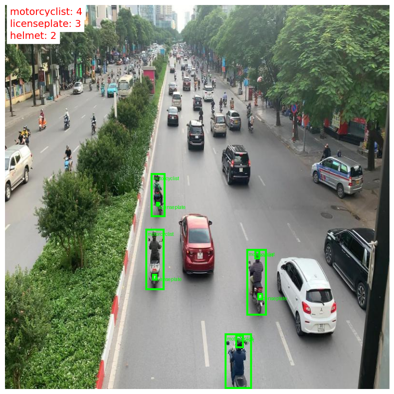
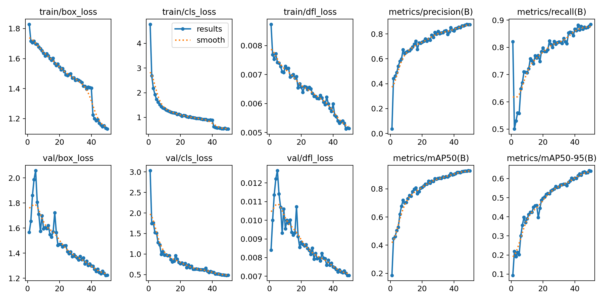
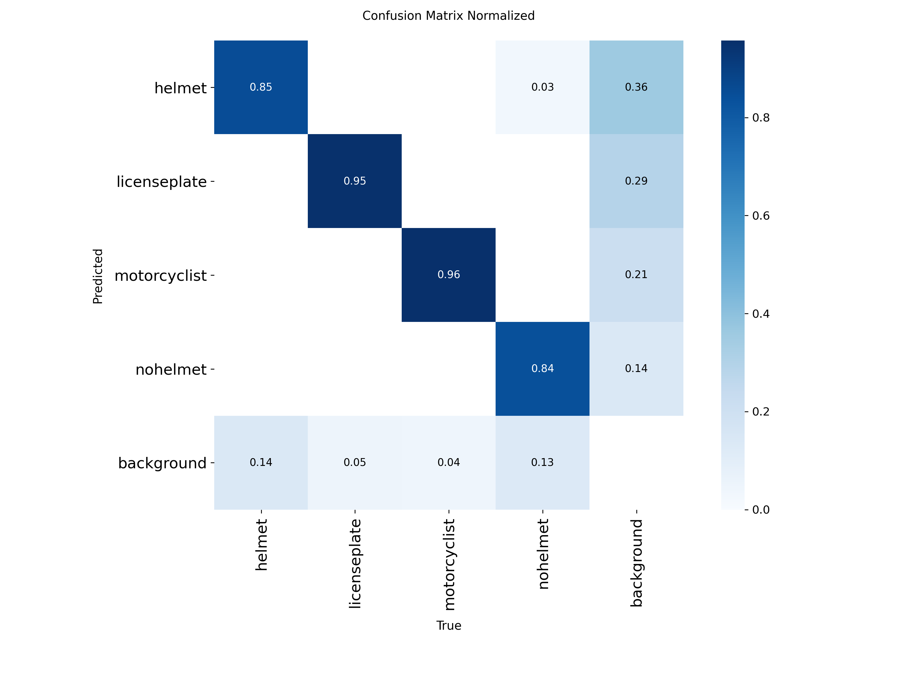

# 🪖 Helmet Detection — YOLOv11


Phát hiện **người không đội mũ bảo hiểm** khi đi xe máy sử dụng **YOLO26n**, huấn luyện trên Kaggle GPU T4 x2. Web app demo xây dựng bằng **Streamlit**, hỗ trợ nhận diện ảnh và video với cảnh báo trực tiếp.

---

## Demo



**Chạy web app local:**
```bash
streamlit run app.py
```
Mở trình duyệt tại `http://localhost:8501`

---

## Kết quả huấn luyện mô hình


| Training Curves | Confusion Matrix |
|:---:|:---:|
|  |  |

---

## 4 Class được phát hiện

| Class | Mô tả | Mức độ |
|-------|-------|--------|
| `helmet` | Đội mũ bảo hiểm | 🟢 An toàn |
| `motorcyclist` | Người đi xe máy | 🟢 Thông tin |
| `licenseplate` | Biển số xe | 🟢 Thông tin |
| `nohelmet` | Không đội mũ bảo hiểm | 🔴 Cảnh báo vi phạm |

---


---

## Dataset

| | |
|---|---|
| **Nguồn** | Roboflow Dataset public |
| **Link** | [Helmet Detection and License Plate Recognition](https://universe.roboflow.com/fpt-university-9oa0t/helmet-detection-and-license-plate-recognition-zfenu/dataset/6) |
| **Số class** | 4 (helmet, nohelmet, motorcyclist, licenseplate) |
| **Format** | YOLO (YOLO txt labels) |

---

## Pipeline huấn luyện 

| Bước | Nội dung |
|------|---------|
| 1 | Cài đặt Ultralytics, kiểm tra GPU |
| 2 | Cấu hình tham số train |
| 3 | Huấn luyện YOLO26n — 50 epochs, batch 64, SGD |
| 4 | Vẽ training curves (Box/Cls/DFL loss) |
| 5 | Đánh giá trên tập test |
| 6 | Inference ảnh & video mẫu |
| 7 | Export ONNX / TensorRT |


---

## Tham số huấn luyện

| Tham số | Giá trị |
|---------|---------|
| Model | `yolo26n.pt` |
| Epochs | 50 |
| Image size | 640 × 640 |
| Batch size | 64 |
| Optimizer | SGD |
| Device | GPU  |
| AMP | True (Mixed Precision) |
| Cache | True |
| Augmentation | HSV, degrees, translate, mosaic |

---

## Cài đặt & chạy

```bash
# Clone repo
git clone https://github.com/Namvipcf/helmet-detection-yolo26.git

# Cài thư viện
pip install -r requirements.txt
```

**Chuẩn bị model ONNX:**
```python
# Nếu có best.pt, export sang ONNX trước
python scripts/export_onnx.py
```
Hoặc tải `best.onnx` 

**Chạy web app:**
```bash
streamlit run app.py
```

---

## Tính năng Web App

**Tab Ảnh:**
- Upload nhiều ảnh cùng lúc (JPG, PNG, WEBP, BMP, TIFF, GIF)
- Hiển thị ảnh gốc và ảnh đã gắn nhãn song song
- Bảng tổng hợp số lượng từng class
- Cảnh báo đỏ ngay lập tức khi phát hiện `nohelmet`

**Tab Video:**
- Upload video (MP4, AVI, MOV, MKV)
- Xử lý từng frame, hiển thị preview realtime
- Đếm số frame vi phạm, tính tỷ lệ vi phạm
- Tải về video đã gắn nhãn

**Sidebar:**
- Điều chỉnh ngưỡng confidence (0.1 – 0.95)
- Tùy chỉnh đường dẫn model ONNX
- Xóa toàn bộ dữ liệu đã upload

---


## Môi trường

| | |
|---|---|
| Platform | Local |
| GPU | NVIDIA |
| Framework | Ultralytics |
| Web | Streamlit 1.35+ |
| Export | ONNX, TensorRT FP16 |

---

## License

MIT License — xem [LICENSE](LICENSE)

---

## Tác giả

**Hoàng Quốc Khánh**
- GitHub: (https://github.com/dtc225200663-dotcom)
